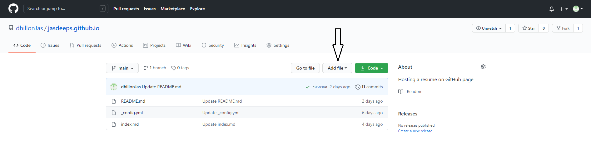
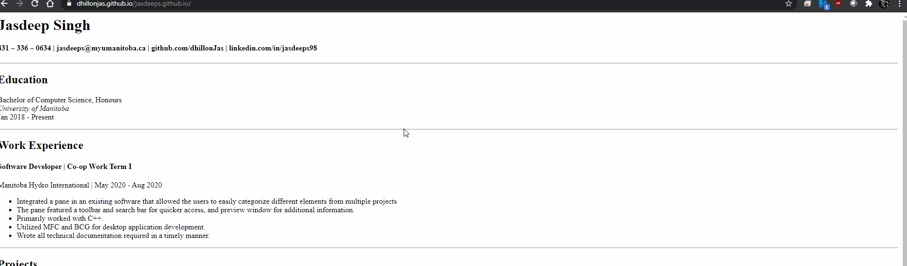

# Hosting your resume on GitHub pages

## Purpose
This README describes how to apply the strategies and protocols mentioned in Andrew Etter's book *Modern Technical Communication*. We will host a resume on GitHub pages using those strategies.

## Prerequisites
A resume formatted in Markdown will be required. If you do not know how Markdown works, a link to a Markdown tutorial is provided in "More resources" at the bottom.

## Instructions
### 1. Make/Log in GitHub account**   
  Andrew Etter talks about using distributed version control in his book. The prominent reasons for that: better performance, easier concurrent work and allows offline work. If you have to change anything in your resume, you can just pull it, which basically means download it, and make the changes. When you feel you are done, you will have to make just one commit and push, which is just uploading the updated file. You can work on your files for as long as you want without having to worry about losing your internet connection.   
  How does it helps in concurrecy? You can have mulitple people make changes to your resume at the same time. Everyone can pull, make changes, and push to a different branch. Then you can check which one you would like and merge their branch with the main branch. Merging is just combining the content of both the files. Now, the benefits of using a version control does not just stop here. In case, you think someone else had made better changes to your resume, you can always revert back to your original changes and merge that with any other branch.

* First and foremost, you *will* need a GitHub account. If you do not have one, you can click [here](https://github.com/) to create your account.
  
### 2. Create a repository
We are using GitHub pages to host a resume as a static website. Etter talks about static websites in his book by saying,   
> I love their speed, simplicity, portability, and security. [...] They have no server-side application     dependencies, no databases, and nothing to install, so migrating the entire site is as easy as moving a directory.   

Static websites are faster, simple and secure. Since there is no content that is generated dynamically, it does not use too much hardware resources. They can also be tested without the need of installing anything. Moreover, using websites make it easier to update your content as opposed to having PDFs. You can not update a document that is lying on someone else's computer but if everything is hosted on a website, editing and updating is just a few clicks away. 
  * Next step is create a repository in your account. This repository is like a folder which will have your resume.
  
  * While on your homepage in GitHub account, navigate to top right of the screen and click the **plus** icon. 
  
  * Select **New repository** from the dropdown menu. 
  
  * It will open a new page where you can choose the name, description and theme for your repository. This page also asks you if you want to the repository to be public or private.
  
  * The name of your repository *must* be in the following format: `username.github.io`.
  
  * Once you are done filling in the details, click **Create Repository** at the bottom of the page.  
  
### 3. Add a file  
  Using files in lightweight markup format has one big reason: it is easy. As Etter says in his book
  > The entire point of lightweight markup is to make it easier to produce well-formed XML, and we need XML in order to build websites.   
  
  Markdown is one of the most popular markup language. Markup languages are like human-readable XML. If you want more people to contribute to your resume, using a markup language is the way to go. Again, a markdown tutorial is provided in the "More resources" tab, if you would like to delve more into the langauge.
  
  * Open a repository and click on **Add file** at the top as shown in the picture below.
    
    
  * Click on **Create new file** to make a new file.
  
  * Cilck on **Upload files** to use existing files from your desktop.
  
  * You can add a README.md here, *if* you did not add it during previous step.
  
  
### 4. Add a theme   
You should always try to include headers, images or themes in your documents. As Etter talks about this in his book, these additions will make your writing more approachable and simpler to read than just lines of paragraphs. There are multiple static site generators we can use to add themes and graphics. We are using Jekyll. Jekyll is the most popular and is very easy to learn. It provides some built in theme templates that can you can use. It also gives you the option to create your own template.  

  * To include a theme for your GitHub page, open your repository and click on Settings at **top-center**.
  
  * Scroll down to *GitHub Pages* section and click **Change Theme**.
  
  * Select your desired theme from the list and click **Select theme**. 
  
  * When adding a theme for the first time, it will create two new files in your repository.  
     * index.md : This is the file that is linked with the theme. Paste your resume formatted in markdown in this file.
     
     * _config.yml : This is the Jekyll file for your theme. You can look up online on what else can be changed through the file.    
     
   
     
    Note : The demo in the GIF shows how to change the theme, that is why there is index.md already created.

### 5. Opening the link
  * To see the URL where your resume is hosted, go to **Settings** and scroll down to *GitHub pages* section.
  
  * There is a line written at the top of the section.   
  
  >Your site is published at `URL`
  
  * Click on that URL to see your resume hosted.
  
  * The `URL` will always be in the format **https<nolink>://username.github.io/**

## More Resources
1. To get started on markdown, click [here](https://www.markdownguide.org/basic-syntax/).

2. To buy Andrew Etter's book, click [here](https://www.amazon.ca/Modern-Technical-Writing-Introduction-Documentation-ebook/dp/B01A2QL9SS).

3. To learn more about Jekyll, click [here](https://jekyllrb.com/).

## Authors and Acknowledgments
1. Jasdeep Singh

2. Jaskaran Singh

3. Ruiqi Zeng

4. Anna Messejnikov

## FAQs
**1. Why is my resume not showing up?**  
 * When creating a file for the first time, it might take a while for it to show up. You should wait a few minutes and try refreshing the page later.
 
 * Make sure the resume is in a file called **index.md**

**2. Why is my theme not changing?**  
 * Similar to previous answer, it might take some time to change the theme. Keep refreshing the page and the theme will eventually update.
 
**3. Adding a theme for the first time creates a new branch. How can I change it to add the theme to main?**  
  * Open your repository and click **Settings** at the top.
  
  * Find **GitHub Pages** section at the bottom of the page.
  
  * In the **Source** subsection, click on **Branch**.
  
  * Select `main` from the dropdown and click **save**.
  
  * This will change your settings to allow GitHub Pages to make changes in your main branch.
